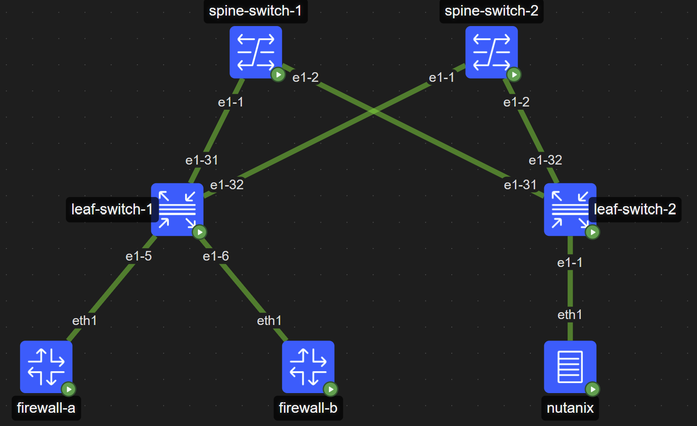

# VLAN Switching over EVPN (VLAN Local Significance & Translation) — Nokia SR Linux + containerlab

This lab demonstrates **VLAN switching across an EVPN/VXLAN fabric** using Nokia SR Linux and `containerlab`.

It proves two related concepts:

1) **VLAN local significance**: the same VLAN ID (e.g., VLAN 10) can be reused on different ports/services without leaking traffic, as long as the services are separated (here: **separate MAC-VRFs**).
2) **VLAN translation across the fabric**: client VLANs on one side (101/102) can be “mapped” to a different VLAN ID on the service side (10) while still being part of the same end-to-end L2 service — using EVPN/VXLAN and MAC-VRFs.

> In this topology:
> - Client1: VLAN **101** (Nutanix side) → VNI **101** over EVPN → VLAN **10** (Firewall-A side)
> - Client2: VLAN **102** (Nutanix side) → VNI **102** over EVPN → VLAN **10** (Firewall-B side)

## Topology (2 Spines + 2 Leafs)

- **Spines** = EVPN route reflectors (overlay iBGP EVPN)
  - `spine-switch-1` (loopback 10.0.0.11/32)
  - `spine-switch-2` (loopback 10.0.0.12/32)
- **Leafs** = EVPN VTEPs (VXLAN tunnel endpoints)
  - `leaf-switch-1` (loopback 10.0.0.1/32) = service-side leaf (firewalls)
  - `leaf-switch-2` (loopback 10.0.0.2/32) = client-side leaf (nutanix)

**Links (high level):**
- Each leaf uplinks redundantly to both spines using `e1-31` and `e1-32`.
- `nutanix` connects to `leaf-switch-2:e1-1`
- `firewall-a` connects to `leaf-switch-1:e1-5`
- `firewall-b` connects to `leaf-switch-1:e1-6`

---

## What happens in the lab

### Linux side (hosts)
We simulate hosts using Linux containers + network namespaces:

- **nutanix** creates:
  - `ns101` on VLAN 101 with an IP in `10.10.10.0/24`
  - `ns102` on VLAN 102 with an IP in `10.10.10.0/24`
- **firewall-a** creates:
  - `ns10` on VLAN 10 (service VLAN) with an IP in `10.10.10.0/24`
- **firewall-b** creates:
  - `ns10` on VLAN 10 (service VLAN) with an IP in `10.10.10.0/24`

These namespaces are created automatically via the `exec:` actions in the containerlab topology.

### SR Linux side (EVPN + VLAN mapping)
There are two MAC-VRF services:

- `l2_cliente1`:
  - leaf-switch-2: `ethernet-1/1.101` (client VLAN 101)
  - leaf-switch-1: `ethernet-1/5.10` (service VLAN 10)
  - EVPN/VXLAN: VNI 101, RTs for 101
- `l2_cliente2`:
  - leaf-switch-2: `ethernet-1/1.102` (client VLAN 102)
  - leaf-switch-1: `ethernet-1/6.10` (service VLAN 10)
  - EVPN/VXLAN: VNI 102, RTs for 102

Even though **VLAN 10 is reused** on two different firewall-facing ports, the traffic stays isolated because each VLAN 10 attachment belongs to a **different MAC-VRF**.

---

## Quick start

### 1) Deploy the lab "bash"

containerlab deploy --topo lab_vlan_switching_evpn.clab.yml

### 1) Inspect the lab

containerlab inspect --topo lab_vlan_switching_evpn.clab.yml

### 3) Check namespaces on the Linux nodes

docker exec -it nutanix ip netns list

docker exec -it firewall-a ip netns list

docker exec -it firewall-b ip netns list

### 4) Verification (expected behavior)
# should succeed
docker exec -it nutanix ip netns exec ns101 ping -c 3 10.10.10.101
docker exec -it nutanix ip netns exec ns102 ping -c 3 10.10.10.102

### 5) Reachability that SHOULD NOT work
# From nutanix:
# ns101 should NOT reach firewall-b and ns102 should NOT reach firewall-a
# should fail
docker exec -it nutanix ip netns exec ns101 ping -c 3 10.10.10.102
docker exec -it nutanix ip netns exec ns102 ping -c 3 10.10.10.101

# ns101 should NOT reach ns102 (they are in different VLANs/services)
# should fail
docker exec -it nutanix ip netns exec ns101 ping -c 3 10.10.10.202
docker exec -it nutanix ip netns exec ns102 ping -c 3 10.10.10.201

# ns10 in firewall-a shouldNOT reach ns10 in feirewall-b and vice versa
# should fail
docker exec -it firewall-a ip netns exec ns10 ping -c 3 10.10.10.102
docker exec -it firewall-b ip netns exec ns10 ping -c 3 10.10.10.101

### 6) Tear down
containerlab destroy --topo lab_vlan_switching_evpn.clab.yml